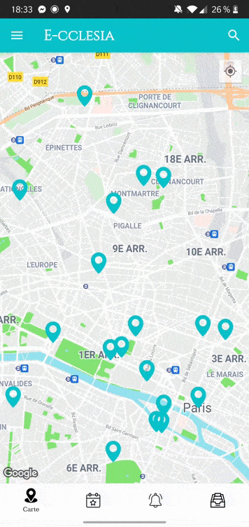
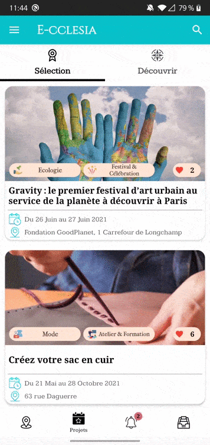
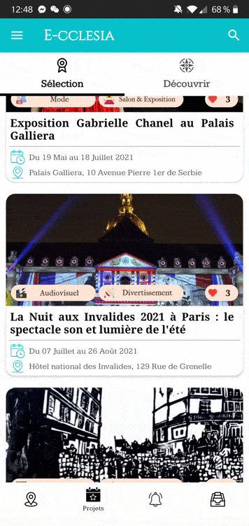
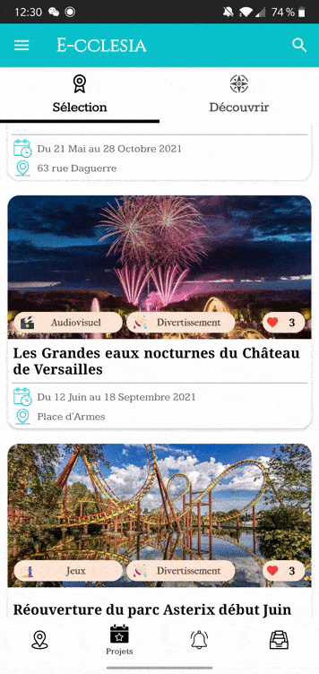
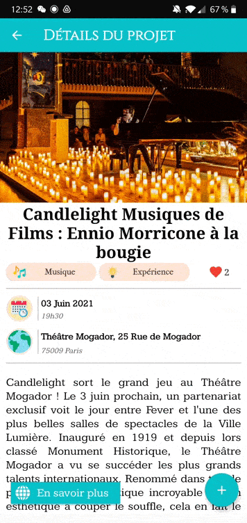
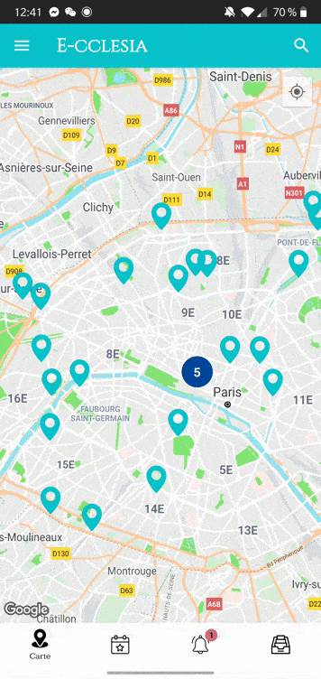
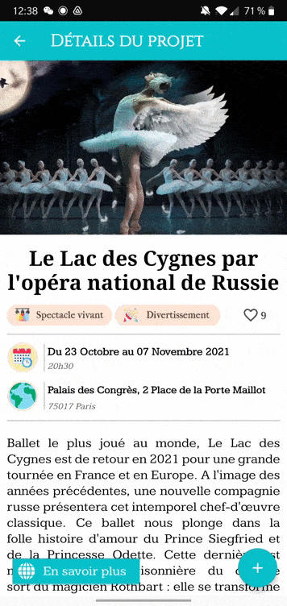
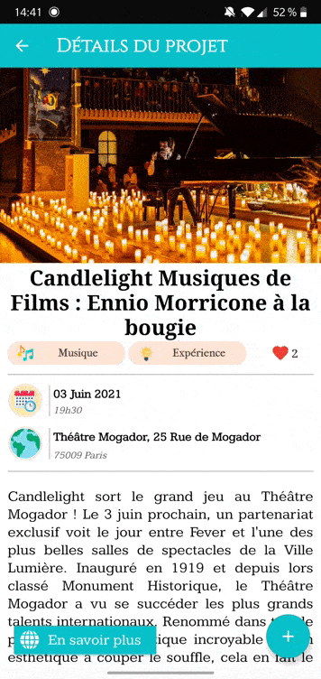

***
## **Project overview**

***

## **Description**

E-cclesia is an app for smartphones which allows its users to take part in citizen, social and cultural activities geographically close to them. It counts numerous projects in its database, which are stocked with information about their location, nature and the theme to which they relate. With the help of a location tracking system, each user is able to learn about projects or events, located nearby their living place or on their daily commute. They can then choose to interact with those - by signing a petition, financially supporting them, booking tickets to participate, etc. - if they find them of any interest, or even to share them with other users as on any kind of social network. Within the application, a personalized algorithm based on this interaction can thus offer suggestions likely to awaken the users’ interests.

This project is consistent with the digital world in the service of humankind. It indeed offers to anyone the possibility to develop their citizen, social and cultural life through a digital device. E-cclesia makes democracy accessible to all by allowing them to share their own ideas and projects as well.

***
## **Features and Interface**

<table>
  <tr>
    <td align="center"><strong>Use the map screen</strong></td>
    <td align="center"><strong>Explore today's selection</strong></td>
    <td align="center"><strong>Scroll the discover page</strong></td>
    <td align="center"><strong>Swipe between events</strong></td>
  </tr>
  <tr>
    <td align="center"></td>
    <td align="center"></td>
    <td align="center"></td>
    <td align="center"></td>
  </tr>
</table>
<table>
  <tr>
    <td align="center"><strong>Add event to favorites</strong></td>
    <td align="center"><strong>Handle notifications</strong></td>
    <td align="center"><strong>Share event with friends</strong></td>
    <td align="center"><strong>Find more about an event</strong></td>
  </tr>
  <tr>
    <td align="center"></td>
    <td align="center"></td>
    <td align="center"></td>
    <td align="center"></td>
  </tr>
</table>

***
