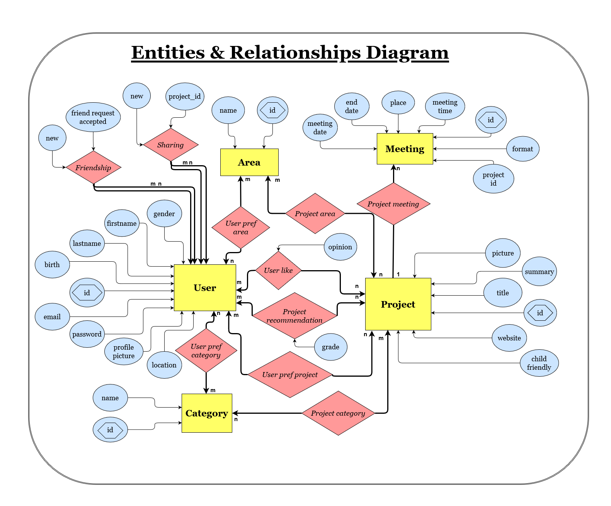

=== Module Base de données

==== Descriptions
[.text-justify]
Ce module a pour objectif de créer une base de données capable de stocker toutes les données nécessaires au fonctionnement de l'application, et de fournir une API complète permettant au reste de l'équipe d'ajouter des données, d'en extraire, et de les manipuler, le tout en garantissant une sécurité lors de l'authentification sur le serveur.

==== Avancement
[.text-justify]
Au PAN2 : +
L'objectif général était de fixer l'architecture de notre base de données afin que l'on soit en mesure de stocker et redistribuer toutes les données utiles aux autres modules. Le choix de cette structure est visible sur le diagramme Entités/Relations ci-dessous et a été pris en considération des besoins exprimés par le reste de l'équipe. Nous avons ensuite défini les méthodes qui seront utiles pour manipuler ces données, en spécifiant à chaque fois les paramètres pris en entrées et la sortie attendue.

.Diagramme entités/relations

{empty}

Au PAN3 : +
Durant cette période nous avons tout d'abord créé la base de données en MySQL, sur le serveur dédié, en suivant l'architecture choisie précédemment. Ensuite nous nous sommes renseignés sur le langage SQL afin de rédiger les requêtes à soumettre à la base de données, et le langage PHP que nous avons utilisé pour l'écriture de l'API qui exécute ces requêtes. Nous avons enfin procédé à de nombreux tests et corrections pour l'intégration et l'utilisation de cette API par le client Android, les web scrapeurs, et les algorithmes de classification et de recommandation. 

Au PAN4 : + 
Une fois l'intégration basique terminée, nous avons pu enrichir la base de données, ainsi que notre API avec de nouveaux scripts permettant de réaliser d'autres fonctionnalités (Partage de projets, horodotage des notifications, etc...).
Enfin nous avons travaillé, avec le module com client/serveur, sur la sécurité de l'accès à la base de données. Pour ce faire nous avons opté pour une librairie PHP permettant de générer et vérifier des token d'accès au format JWT, dans lequel est stocké, entre autre, l'Id, le nom complet de l'utilisateur, ses privilèges (standard ou développeur) mais aussi une date d'expiration correspondant à une durée de validité égale à 15 minutes. Cela nous permet non seulement de sécuriser l'accès aux données mais aussi de faire de la Stateless Authentification c'est à dire de ne pas stocker de Session utilisateur sur le serveur.
