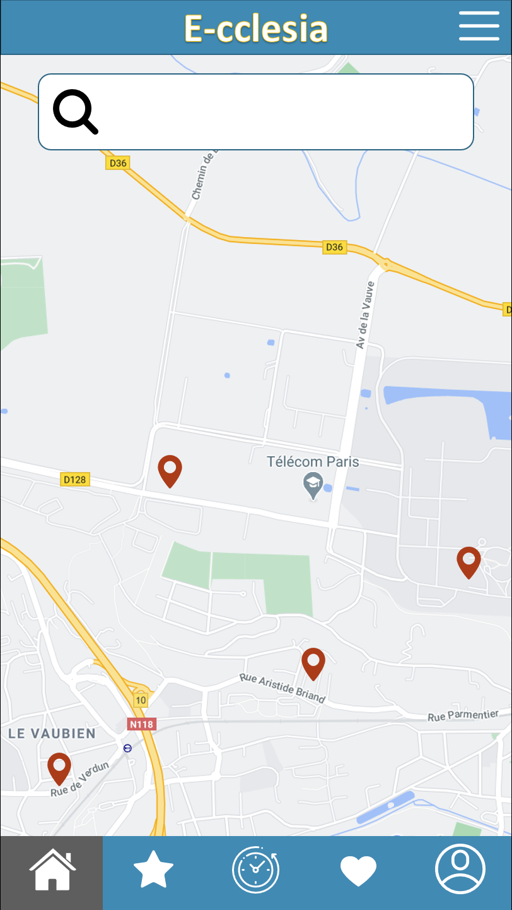
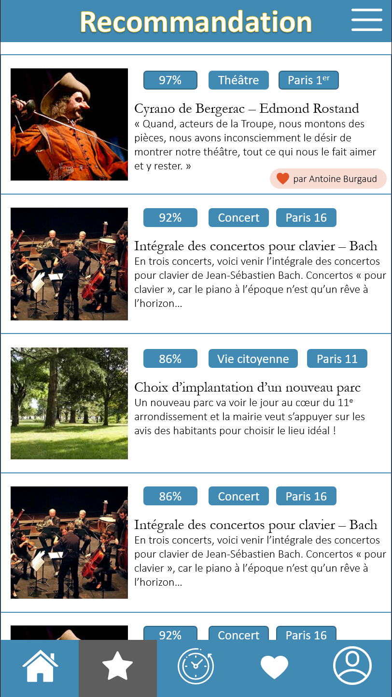
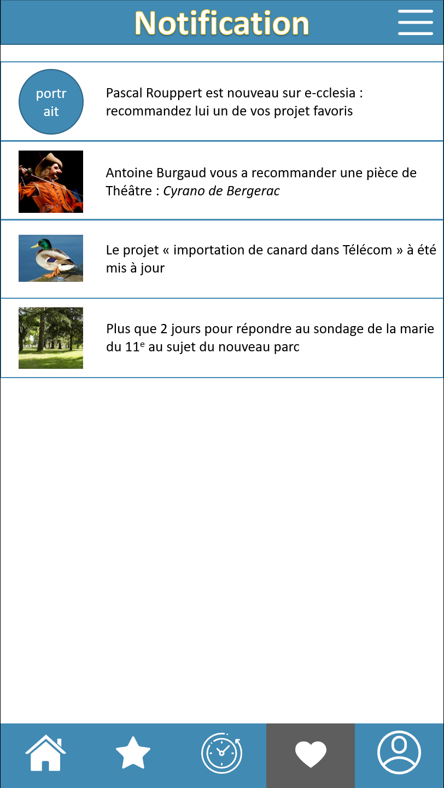
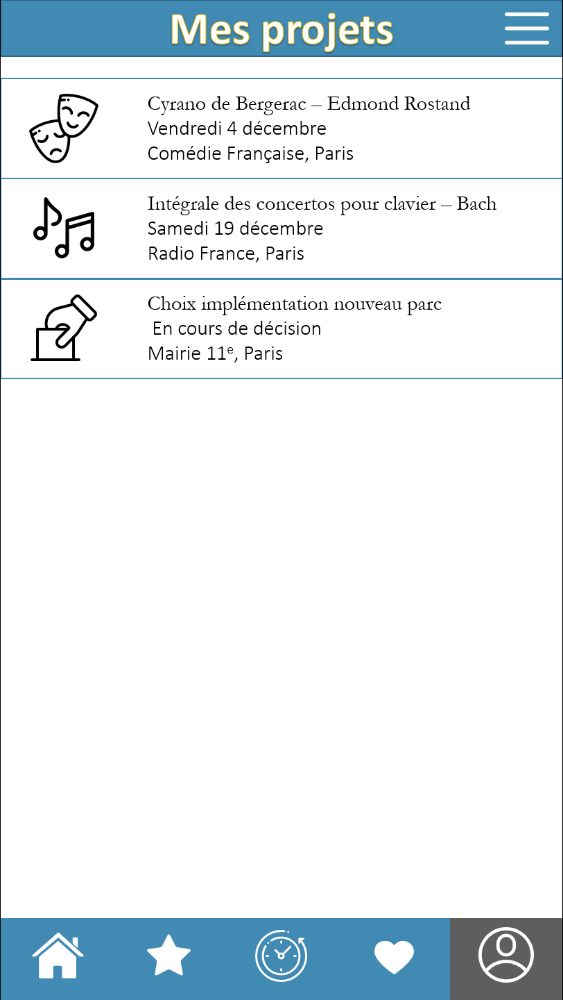
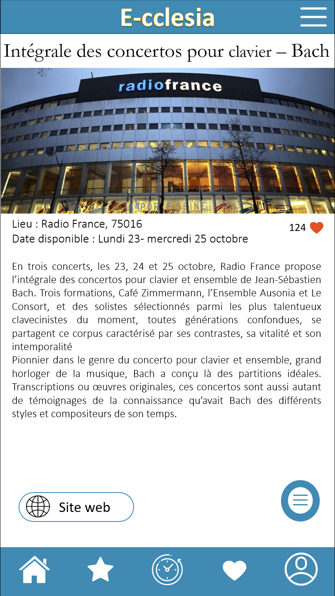
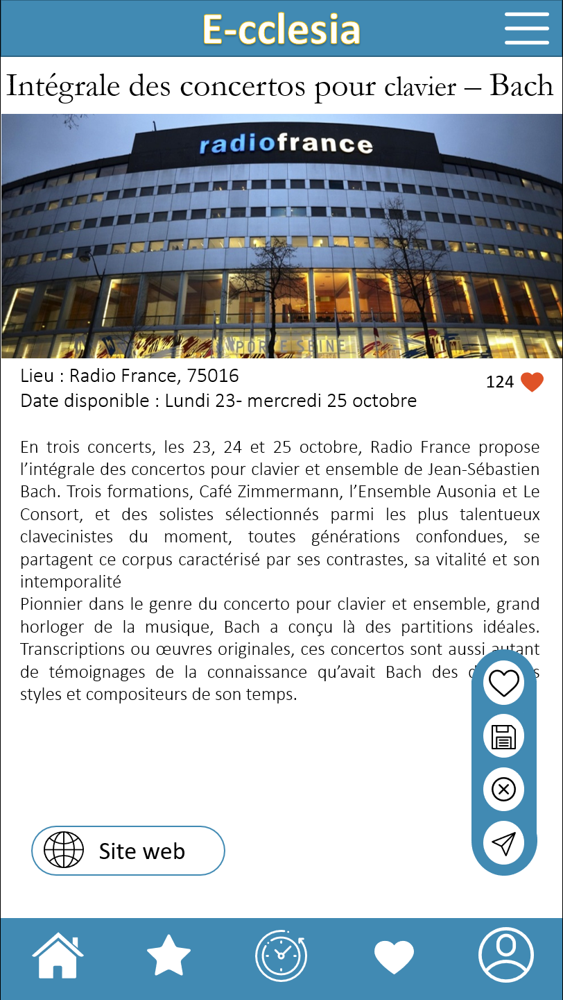

=== Interface utilisateur graphique

Voici l'interface graphique de notre application android :

.Ecran d'accueil
 

{empty} +

.Onglet recommandations

{empty} +

.Onglet notifications

{empty} +

.Onglet Mes projets 

{empty} +

.Ecran d'un projet sans le menu

{empty} +

.Ecran d'un projet avec le menu

{empty} +
