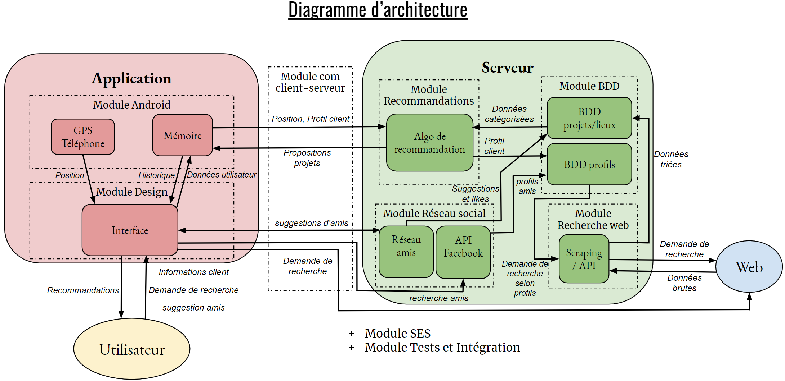

=== Schéma d’architecture

.Schéma d’architecture
 
{empty} +

==== Description des blocs

===== Bloc application

====== Module Android
L’application a besoin d’une mémoire contenant des informations accessibles même lorsque l’utilisateur n’a pas accès à Internet (par exemple le profil de l’utilisateur et les projets qu’il a aimés).
De plus, l’application fonctionne en partie grâce à la position de l’utilisateur afin de lui transmettre des projets dans des lieux qu’il a fréquentés et qui pourraient donc l’intéresser.
Ces deux blocs font partie du module Android.

====== Module Design
Ce module consiste à coder l’interface utilisateur et vise à ce que l’application soit simple d’utilisation, lisible et bien présentée afin de faciliter l’expérience de l’utilisateur.

====== Module Communication client-serveur
Il s’agit dans ce module d’établir et assurer le transfert des informations clients, des recommandations et des requêtes entre l’application Android et le serveur web.

===== Bloc serveur

====== Module Classification automatique et traitement du langage
Le but de ce module est d'assurer la classification automatique des projets trouvés sur le web dans la BDD à l'aide de techniques de traitement du langage.

====== Module Recherche web
Ce module vise à mettre en pratique des techniques pour extraire des informations sur Internet.

====== Module BDD
Notre application doit pouvoir avoir accès aux informations liées à l’utilisateur (son profil, les projets choisis, ses goûts, …) et celles liées aux lieux et projets couverts par l’application. Pour cela elle doit avoir accès à une mémoire où enregistrer et trouver ces données. Cette base de donnée est actualisée régulièrement en lien avec l’activité de l’utilisateur sur E-cclesia.

====== Module Réseau social 
Ce module a pour objectif de créer pour chaque utilisateur un réseau d’amis, dans lequel il sera possible de faire des suggestions de projets à un ami et “liker” les projets appréciés. 

